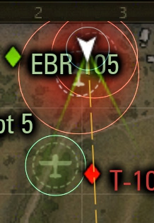
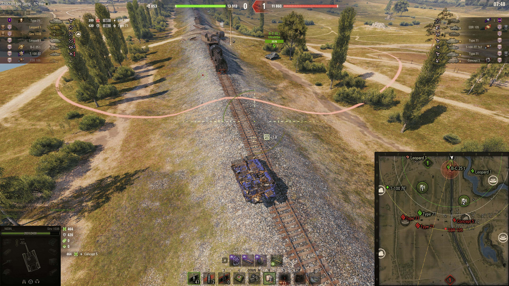
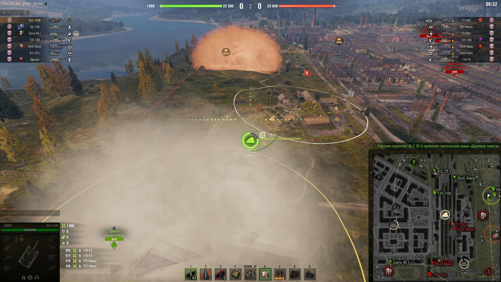

# Индикация авиаразведки и дымов в Натиске

Мод для «Мира танков», который показывает границы авиаразведки и дымовых завес
в режиме «Натиск».

**Версия: 1.2.4 · Проверенный клиент: RU 1.45.0.0 · Автор: NIDIN**

[Скачать мод](https://github.com/xNIDINx/onslaught-recon-bounds/releases/latest) ·
[Страница модов на nidin.ru](https://nidin.ru/mods)

## Возможности

1. Чёткая граница области самолёта на миникарте.
2. Проекция этой границы на местности.
3. Мгновенное включение штатной лампы внутри области вражеского самолёта,
   с сохранением обычной логики засвета.
4. Общий контур дымов на миникарте и местности: союзные — жёлтые,
   вражеские — красно-оранжевые.

Толщина границы дымов на миникарте — 3 px. Наземный контур следует рельефу.
Внешние дуги приближаются отрезками до 1 метра; при большом количестве областей
шаг увеличивается, чтобы оставаться в пределах 1024 отрезков.

Лампа от самолёта предупреждает о нахождении в его области. Мод не меняет
серверное состояние обнаружения. При выезде из области обычная лампа засвета
продолжает работать, если её ещё удерживает игра.

## Скриншоты

## Установка

1. Закрой игру и скачай `nidin.onslaught_recon_bounds_1.2.4.mtmod`
   из [релиза 1.2.4](https://github.com/xNIDINx/onslaught-recon-bounds/releases/tag/v1.2.4).
2. Удали прежнюю версию этого мода из папки `mods/1.45.0.0` клиента.
3. Скопируй скачанный `.mtmod` в `mods/1.45.0.0` и запусти игру.

Для удаления закрой игру и убери этот `.mtmod` из папки модов.
